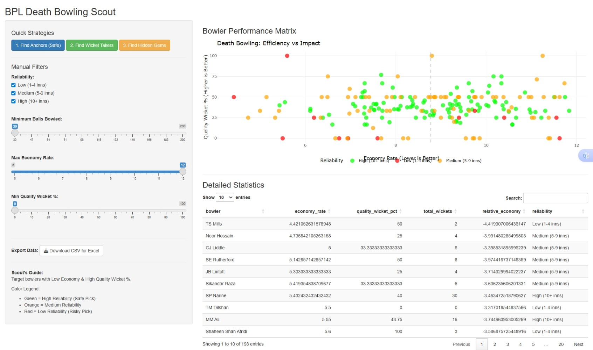
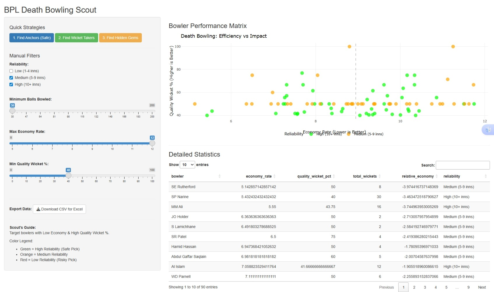
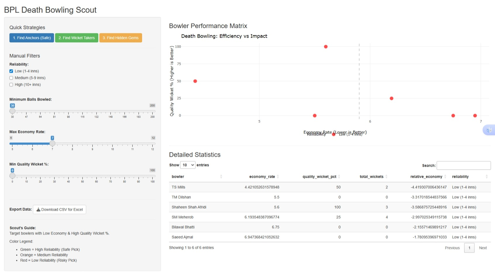

# BPL Death Bowling Scout: User Guide

## **1. Executive Summary**

## System Preview

### **What is this App?**

The **BPL Death Bowling Scout** is a data-driven analysis tool designed specifically for the **Bangladesh Premier League (BPL)**. It processes raw ball-by-ball data to evaluate bowlers based on their performance in the "Death Overs" (typically the final 4-6 overs of a match).

### **Why use it?**

Traditional cricket stats (like total wickets or simple averages) often lie. A bowler might have a low economy rate because they only bowl in easy conditions, or they might have many wickets that are just tail-enders. This app solves that by providing **Context-Aware Metrics**, allowing scouts and coaches to:

1. **Identify Undervalued Talent:** Find bowlers who perform well under difficult conditions but are currently cheap or overlooked.
2. **Assess Reliability:** Distinguish between "One-Game Wonders" and consistent performers.
3. **Strategy Planning:** Find the right bowler for specific match scenarios (e.g., "We need a bowler to defend 10 runs in the last over").

---

## **2. What the App Delivers**

The app provides three unique metrics that you cannot find on standard scoreboards:

- **Relative Economy:** Standard economy rates don't account for the ground. A bowler conceding 8 runs/over in Dhaka (high-scoring ground) is actually doing _better_ than a bowler conceding 8 runs/over in Chattogram (low-scoring ground). This app compares every bowler against the specific venue average.
    - _Interpretation:_ **Negative is Good.** A score of `-2.0` means the bowler is 2 runs cheaper than the venue average.
- **Quality Wicket %:** Measures what percentage of wickets taken were Top-Order batsmen (Positions 1-6). Taking out an opener is more valuable than a tailender.
- **Reliability Score:** A traffic-light system categorizing bowlers by experience:
    - 🟢 **High (10+ Innings):** Safe picks. Large sample size.
    - 🟠 **Medium (5-9 Innings):** Promising but need verification.
    - 🔴 **Low (1-4 Innings):** High risk, small sample size.

---

## **3. How to Use the System**

### **Method A: Quick Strategies (One-Click Insights)**

Use the buttons at the top of the sidebar to instantly apply pre-set filters for common scouting needs.

**1. "Find Anchors (Safe)"**

.jpeg)

- **When to use:** You need a bowler for the final over of a close game. You prioritize stopping runs over taking wickets.
- **What it shows:** High-reliability bowlers (Green) with an economy rate under 7.5.
- **Scout Tip:** Look for the most negative "Relative Economy" values.

**2. "Find Wicket Takers"**

- **When to use:** The opposition has a set batsman, and you need a breakthrough wicket.
- **What it shows:** Experienced bowlers who consistently dismiss Top-Order batsmen (Quality Wicket % > 40%).
- **Scout Tip:** Look for dots high up on the Y-axis.

**3. "Find Hidden Gems"**

- **When to use:** You are building a squad on a budget or looking for young talent.
- **What it shows:** Bowlers with low experience (Red/Orange) but outstanding economy rates (< 7.0).
- **Scout Tip:** These are risky picks. Check the "Balls Bowled" column—if it's only 30 balls, they might be lucky. If it's 60+, they are more legitimate.

---

### **Method B: Manual Filtering**

If you have specific criteria, adjust the sliders manually:

1. **Reliability:** Check the boxes to include/exclude specific experience levels.
    - _Advice:_ Uncheck "Low" if you only want proven players.
2. **Minimum Balls Bowled:** Filters out players with very little data.
    - _Advice:_ Set to **60+ balls** to find regular death bowlers.
3. **Max Economy Rate:** Sets your tolerance for expensive bowlers.
    - _Advice:_ In T20s, anything under 8.0 is good for death overs.
4. **Min Quality Wicket %:** Filters for wicket-taking impact.
    - _Advice:_ Set to **30%** to filter out bowlers who only take tailender wickets.

---

## **4. Reading the Visuals**

**The Scatter Plot:**

- **X-Axis (Economy Rate):** Left is Good (Low Economy), Right is Bad (High Economy).
- **Y-Axis (Quality Wicket %):** Top is Good (High Impact), Bottom is Low Impact.
- **Ideal Zone:** The **Top-Left Quadrant**. These are your "Unicorn Bowlers"—they don't concede runs AND they take top-order wickets.
- **Colors:**
    - Green Dots = High Trust.
    - Orange Dots = Moderate Trust.
    - Red Dots = Verify with video scouting.

**The Data Table:**

- Scroll down to see the raw numbers.
- Click column headers to sort (e.g., click `relative_economy` to see who saves the most runs compared to the ground).
- Use the **"Download CSV for Excel"** button to export your filtered list and share with coaches.

---

## **5. Summary for Scouts**

- **Don't trust the Economy Rate blindly.** Always check the **Relative Economy** column to see if the bowler was helped by a bowling-friendly ground.
- **Reliability matters.** A bowler with 100 innings of data is a safer bet than one with 2 good games.

- **Context is King.** Use this data to create a shortlist, but always confirm with video analysis before signing a player.

