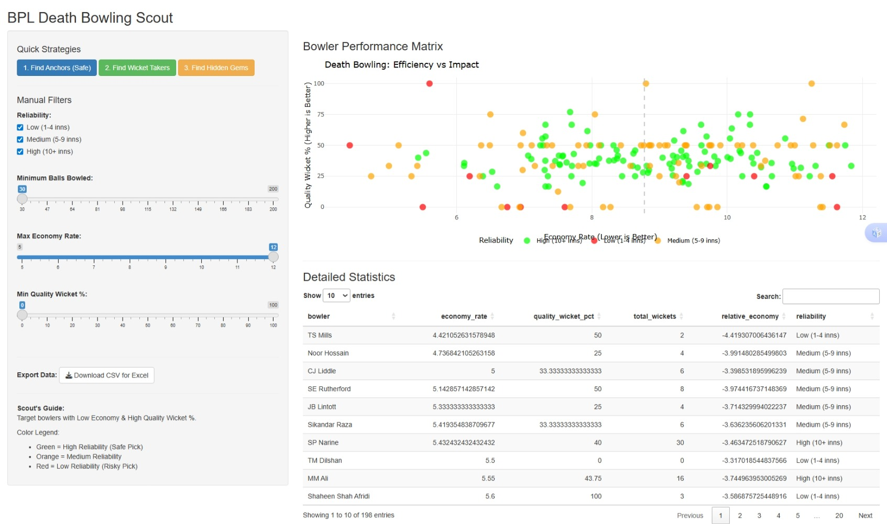
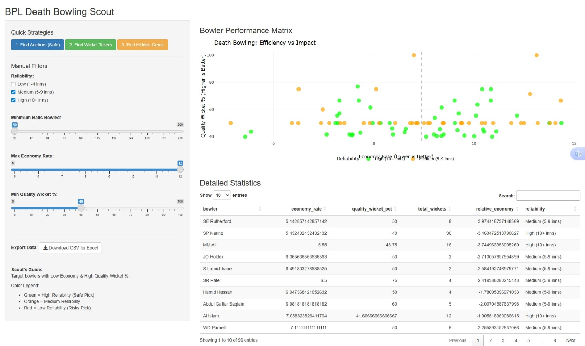
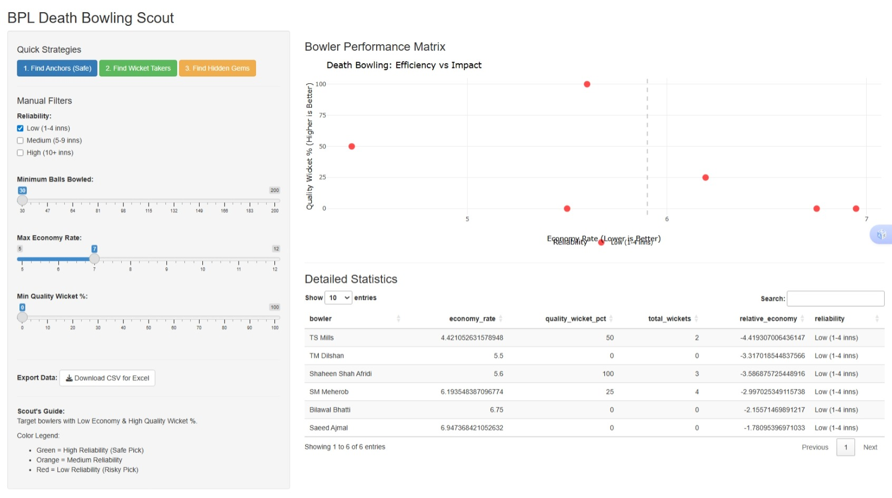

# BPL Death Bowling Scout: Advanced Analytics Guide

## 1. Executive Summary

### What is this App?

The **BPL Death Bowling Scout** is a context-aware cricket analytics system designed to evaluate **bowler performance in high-pressure death overs** in the Bangladesh Premier League (BPL).

Unlike traditional metrics, this system adjusts for:
- Venue scoring conditions  
- Match context  
- Quality of opposition  
- Sample size reliability  

This enables **fair, comparable, and decision-relevant evaluation** of bowlers.

---

### Why This Matters

Standard metrics such as economy rate and total wickets often mislead due to:
- Pitch conditions (flat vs slow)
- Role bias (death vs middle overs)
- Weak opposition inflation
- Small sample randomness

This system corrects these issues using **context-normalized and reliability-aware metrics**, allowing:

- Identification of undervalued talent  
- Risk-aware player selection  
- Scenario-specific strategy planning

### *Visit the link to directly access the web app:* 
### *[Live App (All BPL Seasons)](https://mwb554-novomahmud.shinyapps.io/BPL_Scouting_Project_2012-26/)*
### *[Live App (BPL Seasons from 2021-22 to 2025-26)](https://mwb554-novomahmud.shinyapps.io/BPL_Bowlers/)*

---

## 2. Core Metrics (Context-Aware)

### 2.1 Relative Economy (Context Normalization)

Measures how a bowler performs relative to the **venue-specific scoring environment**.

**Formula:**
Relative Economy = Bowler Economy − Venue Average Economy  

- Negative → Better than venue average  
- Positive → Worse than venue average  

📌 This removes **pitch bias**, making bowlers comparable across grounds.

---

### 2.2 Quality Wicket Percentage (Impact Metric)

Measures the proportion of wickets taken against **top-order batters (positions 1–6)**.

**Why it matters:**
- Top-order wickets significantly change match outcomes  
- Tailender wickets inflate traditional stats  

---

### 2.3 Reliability Score (Sample Size Control)

Categorizes bowlers based on exposure:

| Level | Innings | Interpretation |
|------|--------|---------------|
| 🟢 High | 10+ | Statistically reliable |
| 🟠 Medium | 5–9 | Moderate confidence |
| 🔴 Low | 1–4 | High uncertainty |

📌 This acts as a **proxy for statistical confidence**, preventing overreaction to small samples.

---

## 3. Decision Framework

### Interpreting the Scatter Plot

- **X-axis:** Economy Rate (lower is better)  
- **Y-axis:** Quality Wicket % (higher is better)  

### Ideal Region

The **top-left quadrant** represents:
- Low economy  
- High-impact wickets  

These are **elite death bowlers**.

---

## 4. Scouting Modes

### 4.1 Safe Death Bowlers (Anchors)

- High reliability  
- Low economy  
- Used in defensive match scenarios

.jpeg)

---

### 4.2 Strike Bowlers

- High Quality Wicket %  
- Used when breakthroughs are required

---

### 4.3 Hidden Gems

- Low exposure but strong performance  
- Requires further validation (video + extended data)  

---

## 5. Statistical Considerations

### 5.1 Context Adjustment

All performance is evaluated relative to:
- Venue scoring baseline  
- Match conditions  

---

### 5.2 Sample Size Awareness

Reliability score ensures:
- High-variance players are flagged  
- Stable performers are prioritized  

---

### 5.3 Limitations

- Does not model full match context (e.g., pressure index, required run rate)
- Does not include Bayesian uncertainty (future enhancement)
- Should be combined with video scouting

---

## 6. Validation Insight (Preliminary)

Initial analysis suggests that:
- Bowlers with consistently negative Relative Economy  
- And high Quality Wicket %  

tend to sustain performance across matches.

📌 Full multi-season validation is part of the extended analytics system.

---

## 7. Integration with Advanced Scouting Systems

This tool serves as a **modular component** of a broader cricket analytics framework, which may include:

- Bayesian player ability estimation  
- Role-based clustering  
- Composite Scouting Index (CSI)  
- Multi-season predictive validation  

---

## 8. Practical Use Case

Use this tool to:

1. Generate a shortlist of bowlers  
2. Identify undervalued or emerging talent  
3. Evaluate performance under pressure scenarios  
4. Support selection decisions with contextual data  

---

## 9. Final Note

> This system is designed to **support decision-making, not replace it**.

Cricket performance is inherently contextual.  
Data provides clarity — but final decisions require **human judgment**.
